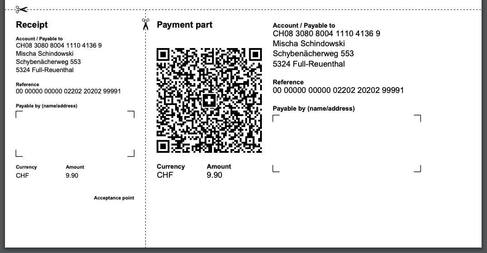

# Prawn::SwissQRBill

A Ruby library for creating Swiss QR-bill payment slips inside a PDF. It is
built as a [Prawn](https://github.com/prawnpdf/prawn) extension.


[](https://rubygems.org/gems/prawn-swiss_qr_bill)
[](https://github.com/mitosch/prawn-swiss_qr_bill/actions/workflows/ci.yml)
[](https://codecov.io/gh/mitosch/prawn-swiss_qr_bill)

## Installation

Add the following line to your `Gemfile`:

```ruby
gem 'prawn-swiss_qr_bill'
```

or install it manually:

```bash
gem install prawn-swiss_qr_bill
```

## Basic Usage

Define the relevant information for the Swiss QR-bill and render it inside the Prawn block:

```ruby
require 'prawn'
require 'prawn/swiss_qr_bill'

@bill_data = {
  creditor: {
    iban: 'CH08 3080 8004 1110 4136 9',
    address: {
      name: 'Mischa Schindowski',
      line1: 'Schybenächerweg 553',
      line2: '5324 Full-Reuenthal',
      country: 'CH'
    }
  },
  amount: 9.90,
  currency: 'CHF',
  reference: '00 00000 00000 02202 20202 99991',
  reference_type: 'QRR'
}

Prawn::Document.generate('output.pdf', page_size: 'A4') do
  text 'A Swiss QR bill'

  swiss_qr_bill(@bill_data)
end
```

This will render the Swiss QR-bill at the bottom of the page:



### Bill data structure

The following data structure for the bill can be specified:

```ruby
# *: mandatory
@bill_data = {
  creditor: {
    iban: '<iban>',                 # *
    address: {                      # *
      type: '<K|S>',                # default: K
      name: '<name>',               # *
      line1: '<street> <nr>',       # *
      line2: '<line 2>',
      postal_code: '<postal code>',
      city: '<city>',
      country: '<country>'          # *
    }
  },
  debtor: {
    address: {
      type: '<K|S>',                # default: nil
      name: '<name>',
      line1: '<street> <nr>',
      line2: '<line 2>',
      postal_code: '<postal_code>',
      city: '<city>',
      country: '<country>'
    }
  },
  amount: 9.90,
  currency: '<CHF|EUR>',            # *
  reference: '<ref nr>',
  reference_type: '<QRR|SCOR|NON>'  # default: NON
}
```

If `debtor` or `amount` amount is not given, a box will be printed.

### Options

Calling `swiss_qr_bill()` method with options:

```ruby
# ...
Prawn::Document.generate('output.pdf', page_size: 'A4') do
  # ...

  # raises InvalidIBANError when @bill_data[:creditor][:iban] is invalid
  swiss_qr_bill(@bill_data, validate: true)
end
```

Available options:

| Option | Data type | Description | Default |
| --- | --- | --- | --- |
| `validate` | boolean | Validates IBAN and Reference Number and raises several errors | `false` |

Errors which can be raised during validation:

* `MissingIBANError`: When IBAN is missing.
* `InvalidIBANError`: When IBAN is invalid. It checks for CH-IBAN only.
* `InvalidReferenceError`: When reference is invalid. It checks for a valid QRR or SCOR reference

## Important

This library can validate IBAN (switzerland only) and reference number (types QRR and SCOR).
It does not however validate, if the given data is fully valid according to the implementation guidelines.

Please refer to the implementation guidelines and the Swiss QR-bill validaton
portal by SIX below.

## Contributing

If you miss a feature or you've found a bug, please [open a GitHub issue](https://github.com/mitosch/prawn-swiss_qr_bill/issues).

Pull requests are highly welcome:

* Fork the project
* Make your changes
* Send the pull request

## Authors

Original author: Mischa Schindowski

## Resources

* [Prawn](https://github.com/prawnpdf/prawn): Fast, Nimble PDF Generation For Ruby
* [Swiss QR-bill Validation Portal](https://validation.iso-payments.ch/qrrechnung)
* [Swiss Payment Standards](https://www.paymentstandards.ch):
  * [Style Guide QR-bill](https://www.paymentstandards.ch/dam/downloads/style-guide-en.pdf)
  * [Implementation Guidelines QR-bill](https://www.paymentstandards.ch/dam/downloads/ig-qr-bill-en.pdf)

## Copyright

MIT License (http://www.opensource.org/licenses/mit-license.html)
